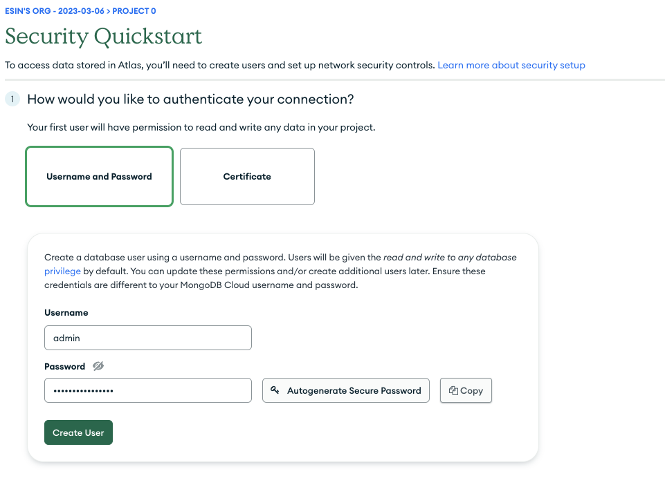

# MongoDB

MongoDB is a popular non-relational, document-based database management software
that is used across industries by a variety of companies like Forbes, Toyota,
Verizon, Expedia, and [many more](https://www.mongodb.com/who-uses-mongodb).

Whether you're a data engineer looking to pick up another database format, or
whether you're a fullstack developer interested in learning more about the
database behind the
[MERN/MEAN stacks](https://medium.com/@devathon_/mean-vs-mern-stack-development-5ba3e517bc68),
you're in the right place to learn more about MongoDB.

## Learning Objectives

- Why MongoDB
- Register for a MongoDB Atlas cloud database account
- Distinguish between database server, database, collection, and documents
- Create, drop and interact with MongoDB databases and collections using the
  MongoDB Atlas cloud interface
- Create, Read, Update and Delete documents in MongoDB collections using MongoDB
  Atlas
- Use Mongo querying syntax to specify querying conditions

## Why MongoDB

Though SQL databases are the older and still a very popular database format,
NoSQL databases have grown in popularity in recent years. NoSQL databases like
MongoDB have many use cases in both
[application development](https://www.mongodb.com/use-cases) and
[data engineering](https://dashbird.io/blog/nosql-database-data-engineering/).

MongoDB is a non-relational, document-based database. It stores data in a format
called binary JSON, or BSON. Because BSON is so close to JSON in form and
function, MongoDB lends itself very well for the database layer of fully
JavaScript stacks.

Non-relational, or NoSQL, databases are different in many ways from the SQL
databases we've worked with in training. They aroseFor starters, we are not
always guaranteed the ACID principles with NoSQL databases, though MongoDB
[can be set up to enforce ACID for multi-document transactions](https://www.mongodb.com/basics/acid-transactions).

With MongoDB, there is no inherent consistency in our data structure, which SQL
tables provide. NoSQL databases are designed to accommodate more varied and
unstructured data, which is useful in scenarios where there are few or changing
requirements for the data, such as rapid app development. This flexibility in
its data model actually makes MongoDB a good database choice for
[content management on digital platforms](https://www.mongodb.com/use-cases/content-management),
which is
[how the digital design platform Canva uses MongoDB](https://www.mongodb.com/blog/post/video-canvas-lessons-scaling-mongodb-atlas-billion-documents-across-nodes).

Because MongoDB is so fast, it's also a well-suited database for handling big,
complex datasets and
[real-time analytics](https://www.mongodb.com/use-cases/analytics/real-time-analytics).
In fact, the name "Mongo"
[comes from "humongous."](https://kchodorow.com/2010/08/23/history-of-mongodb/)
The creators of MongoDB built it in part to better handle the scaling challenges
faced by databases at the time.

MongoDB Atlas also features options for
[both vertical and horizontal scaling](https://www.mongodb.com/basics/scaling),
including auto-sharding, which makes it a great choice for cloud environments.

## Getting Started on MongoDB Atlas

MongoDB is a non-relational database management software. Like many DBMS, it can
be run
[locally on your machine](https://www.mongodb.com/docs/manual/installation/) or
in the cloud.

Today we're going to get started with MongoDB's Atlas service, which is a
cloud-based offering of MongoDB. You might hear the term "Database as a Service"
(DBaaS) used to describe applications like MongoDB Atlas. Other DBaaS examples
include AWS's
[many database offerings](https://aws.amazon.com/products/databases/) (like
DynamoDB, Amazon RDS, and more) as well as
[Google](https://cloud.google.com/products/databases) and
[Azure](https://azure.microsoft.com/en-us/products/). A DBaaS allows your team
to focus on the differentiating features of your application rather than the
infrastructure or administration of the database; a DBaaS handles tasks such as
provisioning the server, installing the database, taking backups, etc.

Let's start by [navigating to MongoDB's website](https://www.mongodb.com) and
signing up or signing in.

> I prefer using OAuth to log into most websites, so that I don't have to
> remember (and forget) another set of credentials.

Once we've created our account or used our Google or GitHub credentials to log
in, we'll accept the terms of service and continue.


After a welcome page, we're greeted with a questionnaire, which MongoDB uses to
collect data on who is signing up for their application.

Let's enter the following (you can choose a different preferred language if you
like -- Python for our data folks, Java for our fullstack folks):


Then click the "Finish" button. This leads us to the screen where we will deploy
our first remote MongoDB database cluster. Let's select the free options, call
our cluster "Learning," then click "Create".


When we click "Create," MongoDB provisions a cluster for us on a server in a
data center of whichever cloud provider we choose (AWS, Google Cloud, or Azure).
We get a corner of the server (which is a fancy computer), which we will share
with other MongoDB customers.

In that corner of the server, which we'll call our cluster, we can create
MongoDB databases! It takes a few minutes to "provision" the cluster, because a
lot is happening in that time. The hardware and network settings to run the
cluster, as well as the software needed to create it, are all being configured
and set up.

This takes us to the Security Quickstart page. For now, let's set up
authentication with a username and password. You can give your default user any
username/password combination you like. Here, I'll use "admin" and use an
auto-generated password, which I'll paste in a text file for temporary
safekeeping.

Be sure to hit "Create User" to actually create that user.



<!-- zznAwlZm3EPxoCPy -->

<!-- 1x5opKOqfvkj3DbH -->

Next, we'll tell MongoDB where we're connecting from. Let's use our local
environment (the computer we're currently on) by clicking "Add My Current IP
Address." Note that with this setting, your cluster will only accept connections
from your current machine, so if you log into your MongoDB Atlas account from
another computer and want to connect to this cluster, you'll need to add that
computer's IP address as well.


When finished, click "Finish and Close," then click "Go to Databases." If your
cluster is finished provisioning, we are ready to dive in!

## Database servers, databases, collections, and documents, oh my!

Congratulations, you've set up your MongoDB cloud database server! 🎉

Now that we have a server set up, we can create databases on it.

Click "Browse Collections" in order to view the databases on this cluster. We
don't have any currently, so let's create our first database on this cluster.
Let's choose the "Add My Own Data" option.


Let's create a database called "mongodb-school" and create our first collection
in it, "users." Hit the "Create" button.


Now that we have our first database with one collection established, let's add
some documents to it. We can insert documents using the "Insert Document" option
in the right corner.

When we do so, you'll notice MongoDB only enforces one field in this document
collection: the `_id`, which is the
[Mongo-generated ObjectId](https://www.mongodb.com/docs/manual/reference/method/ObjectId/),
a UUID for each document. Let's fill the field with some properties that a user
might have.


Click "Insert" to add that document to your users collection. We can also add
multiple users. Click "Insert Document" again, and this time click on the array
brackets for the text field upload. Copy and paste the
[users.json](data/users.json) data into the field. Click the "Insert" button.

**💡 What do you notice about the data?**

**💡 How does the behavior of MongoDB contrast so far to SQL databases?**

It's beyond the scope of today's work, but MongoDB Atlas does offer the ability
to define [schema](https://www.mongodb.com/docs/atlas/app-services/schemas/) for
your data. Additionally, third-party libraries (like
[Mongoose](https://mongoosejs.com/) for Node.js applications) give us a
programmatic way to define schema for our application data.

**💡 What is the relationship between a database server, a database, a
collection, and a document in MongoDB?**

<details><summary>One visualization</summary>


</details>

## CRUD with Documents, Collections, and Databases

We have created a database server, a database, a collection, and multiple
documents. So far, we've been able to create documents as well as read all of
our documents.

What if we want to query for particular data? We can use MongoDB's powerful
[query syntax](https://www.mongodb.com/docs/manual/tutorial/query-documents/) in
order to do so.

Let's delete the data in our current users collection and create new data using
the [users2.json](data/users2.json) file. This data is courtesy of the Dummy
JSON website. This data has many more fields and is also more consistently
structured than the previous data we were working with.

When we read all our data, notice that the field for the query filter is empty,
`{}`. In order to query for more specific data, we need to pass in a filter
condition.

### Specify Equality Condition

To specify equality conditions, use `<field>: <value>` in the query filter.

Let's look for all the users with green eyes.

```c
{ eyeColor: "Green" }
```

**💡 What SQL statement would this correspond to?**

#### You Try

- Find all the users who are 39 years old (1 user)
- Find all the users with B+ blood (2 users)
- Find all the female users (13 users)
- Find all the users with brown hair (7 users)

### Specify Conditions Using Query Operators

To make our queries more sophisticated, we can use Mongo's query operators to do
more than just check for equality in our filter.

We can compare values. Let's find all the users who are 47 years and older.

```c
{ age: { $gte: 47 } }
```

What about all the users who live in California or Arizona? We can check for
multiple matches in a certain field.

```c
{ address.state: { $in: [ "CA", "AZ" ] }}
```

#### You Try

- Find all the users taller than 5'5"
- Find all the users with A+ or A- blood types
- Find all the users who don't live in Kentucky

### Logical Operators

We can also use AND or OR operator logic in our MongoDB query syntax.

-

### Sorting

### Projection

We can select which fields we want to return from our queries using the
"PROJECT" option in the query field.

**💡 What SQL feature does this correspond to?**

### Clean Up

When we are done with a database, we can drop the database as well.

## Next Steps

We explored some of MongoDB's most essential capabilities. It is easy to use and
highly flexible as you saw, and supports a very rich, intuitive query syntax.
MongoDB can do a lot more -- for instance, you can
[index your data](https://www.mongodb.com/docs/manual/indexes/) to make it
faster to search on certain fields.

MongoDB also has a powerful
[aggregation pipeline](https://www.mongodb.com/docs/manual/core/aggregation-pipeline/)
that makes it easy to filter, aggregate, and transform documents in stepwise
fashion.

There are also great tools for visualizing and interacting with your data, like
MongoDB Compass and command line tools.

If this is a topic you're interested in pursuing, here are some of the things
you can try:

- Check out MongoDB's wonderful
  [tutorials](https://www.mongodb.com/docs/manual/tutorial/)
- Build a
  [MERN application](https://www.mongodb.com/languages/mern-stack-tutorial)
- Learn about
  [data modeling](https://www.mongodb.com/docs/manual/core/data-modeling-introduction/)
  in MongoDB
- Interact with MongoDB
  [from a Python application](https://realpython.com/introduction-to-mongodb-and-python/#using-mongodb-with-python-and-pymongo)
- [MongoDB Tutorial](https://www.w3resource.com/mongodb/introduction-mongodb.php)
  on W3 Schools

## References

- MongoDB
  [Query Documents](https://www.mongodb.com/docs/manual/tutorial/query-documents/)
- [Query Operators](https://www.mongodb.com/docs/manual/reference/operator/query/#std-label-query-selectors)
